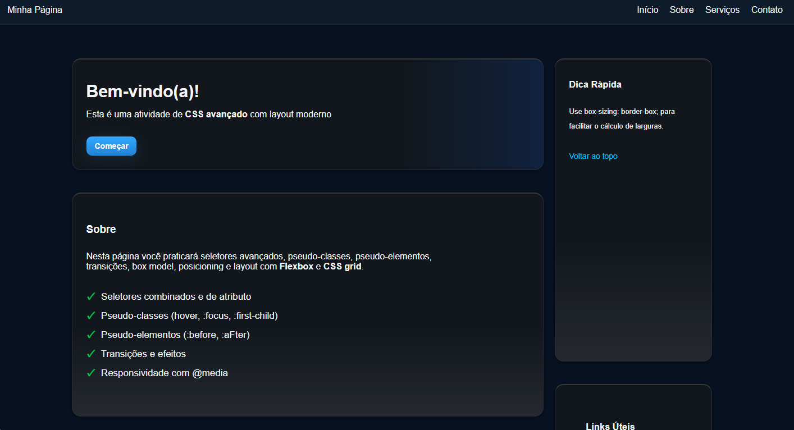
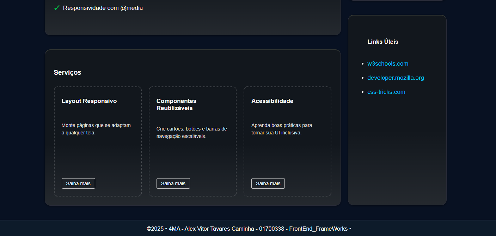

# 🎨 PageCssAdvanced

Projeto focado em **conceitos avançados de CSS** aplicados em uma página HTML, com suporte a **JavaScript** para interações.  
O repositório serve como laboratório para explorar **responsividade, boas práticas de estilização e organização de código front-end**.

---

## 📂 Estrutura do projeto

```
src/
├── css/
│   └── style.css      
├── js/
│   └── script.js       
└── index.html          
```

---

## 🚀 Funcionalidades

- Estrutura modular separando **HTML, CSS e JS**.  
- Uso de **CSS avançado** para criar layouts modernos.  
- Organização de estilos em um único arquivo central (`style.css`).  
- Possibilidade de interações com **JavaScript** (`script.js`).  
- Base para **responsividade** (desktop, tablet, mobile).  
- Estrutura aberta para expansão (novos componentes, temas e interações).  

---

## 🛠️ Como executar

1. Clone o repositório:

   ```bash
   git clone https://github.com/AlexVitor007/PageCssAdvanced.git
   ```

2. Acesse o diretório:

   ```bash
   cd PageCssAdvanced/src
   ```

3. Abra o arquivo `index.html` em um navegador moderno.  

   > 💡 Dica: use extensões como **Live Server** (VS Code) ou servidores locais para ter recarregamento automático.

---

## 📌 Melhorias planejadas

- [ ] Ajustar colunas que perdem alinhamento em telas menores (responsividade).  
- [ ] Implementar **tema escuro com toggle** para alternância dinâmica.  
- [ ] Adicionar mais exemplos de **animações e transições CSS**.  
- [ ] Melhorar **acessibilidade** (semântica HTML, contraste e navegação por teclado).  
- [ ] Incluir **documentação de componentes CSS** dentro do próprio código.  

---

## 📷 Exemplos visuais



---



--- 
